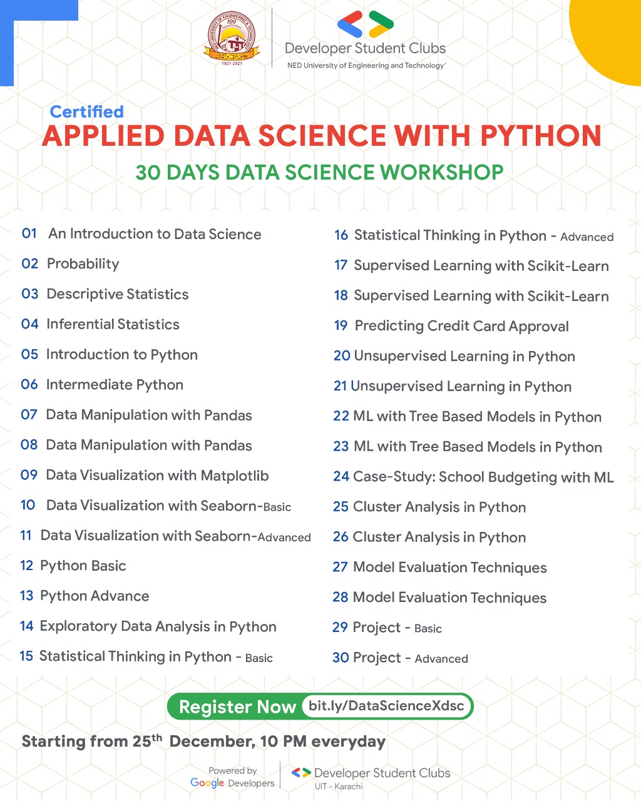

# DSC 30 day workshop

Go to our [Youtube](https://www.youtube.com/channel/UCAwDze2ADlOY-Tf6a6XgkTw) channel to watch the daily lectures.

Join us on [Discord](https://discord.gg/XMdJtVJd).

Join [DSC-NEDUET](https://dsc.community.dev/ned-university-of-engineering-and-technology-karachi/)

## Course Outline

#### All Slides are accessible in below link

Go to: [Slides](https://drive.google.com/drive/u/4/folders/1stgIAbsplLOZKIJ58eGWiS8rx_yQVvz8).

#### Python Data Science Handbook

[Handbook](https://colab.research.google.com/github/jakevdp/PythonDataScienceHandbook/blob/master/notebooks/Index.ipynb#scrollTo=2g5UochL5RaH)

#### Installation

Learn about python installation from [here](https://github.com/DSCNEDUET-X-DSCUIT/Fast-Track-to-Data-Science-30-Days/tree/main/installation).
[Handbook](https://colab.research.google.com/github/jakevdp/PythonDataScienceHandbook/blob/master/notebooks/Index.ipynb)

### Books

1: 100 pages Ml book by Andriy Burkov

2: Aurélien Géron - Hands-On Machine Learning with Scikit-Learn, Keras, and TensorFlow\_ Concepts, Tools, and Techniques to Build Intelligent Systems-O’Reilly Media (2019)

3: Andreas C. Müller, Sarah Guido - Introduction to Machine Learning with Python\_ A Guide for Data Scientists-O’Reilly Media (2016)

4: Data Science For Business by Foster

5: Hands-on Deep Learning algorithms Sudharsan Ravichandiran (packt)

6: Deep Learning by Ian GoodFellow

7: Data Science from Scratch First Principles with Python 2nd Ed by Joel Grus (O'reilly)

8: Machine Learning\_ A Probabilistic Perspective [Murphy] MIT

9: Pattern Recognition in ML by Bishop

10: Elements of Statistical Learning by Hastie and other

11: Introduction to Statistical Learning by Hastie and other

12: Practical Statistics for Data Scientists\_ 50+ Essential Concepts Using R and Python-O'Reilly Media (2020) BYPeter Bruce, Andrew Bruce, Peter Gedeck

### All Notes

All viewable notes are available [here](https://1drv.ms/u/s!AmcOST9vgqoPiC4gg6PEaHijKkrl)
